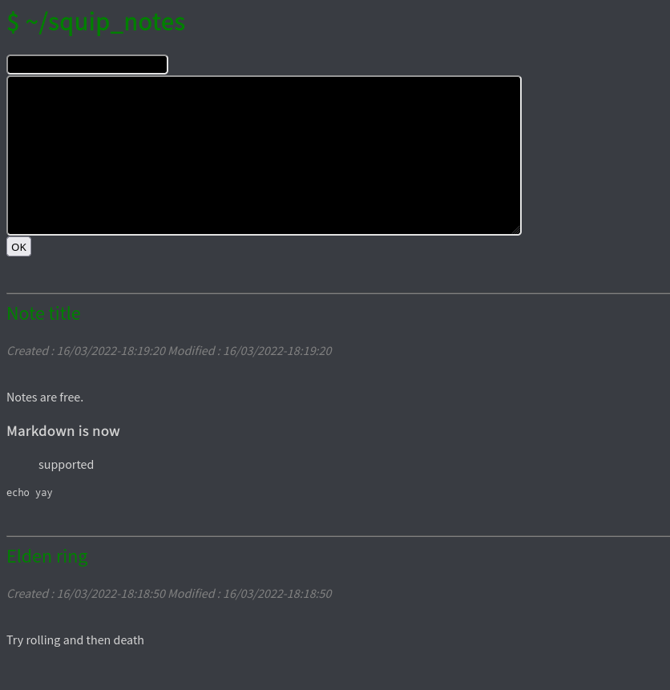

# squip_notes

This is a *very* basic notes-taking program. It uses python with flask and pickle, to give a really light and simple web interface for note taking.

It uses the [dracula](https://github.com/dracula/dracula-theme) colors.



## Changing the code syntax highlight theme
* Install pygmentyze (must be in your path): 
```
python3 pip install pygmentize
```
* List available themes in a python shell:
```python
from pygments.styles import STYLE_MAP
print(STYLE_MAP.keys())
```
* Choose one, dracula for example
* Generate the CSS from your bash/zsh/cmd... shell in a styles.css file:
```bash
pygmentize -S dracula -f html -a .codehilite > styles.css
```
* Replace all css for .codehilite in src/static/main.css with what's in styles.css

## Future features, todo
* A squirrel ascii picture somewhere in the page :3
* Better syntax coloring and markdown rendering in general
