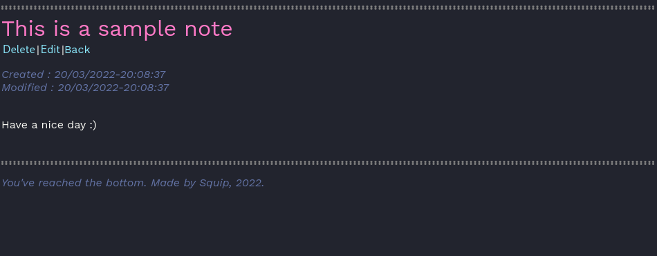

# squip_notes

This is a basic notes-taking program. It uses python with flask and pickle, to give a really light and simple web interface for note taking.

It uses the [dracula](https://github.com/dracula/dracula-theme) colors.




# Features
* No accounts : this is made to be used as a single page (you can't have multiple user accounts). This is best suited as a personnal, self-hosted application in your own network (or it could also work for a work team).
* Simplicity: Simply get on the page and start writing. The notes syntax is markdown.
* Themes : As for now, there is a default dark theme (dracula), and an optionnal light theme (loosely based on solarized light). They can be selected via the interface.

# Themes (adding your own)
All themes are in src/static/styles. They are the .css files. If you want to add your own, simply copy one of the existing files to a new one, named after the others. The numbers in the css file names determine the priority (make yours priority 0 to have it be the default).

## Changing the code syntax highlight theme
* Install pygmentyze (it then must be in your path; pip generally installs things in ~/.local/bin when using a Linux OS): 
```
python3 pip install pygmentize
```
* List available themes in a python shell:
```python
from pygments.styles import STYLE_MAP
print(STYLE_MAP.keys())
```
* Choose one, dracula for example
* Generate the CSS from your bash/zsh/cmd... shell in a styles.css file:
```bash
pygmentize -S dracula -f html -a .codehilite > styles.css
```
* Replace all css for .codehilite in src/static/main.css with what's in styles.css

## Run with Docker
### Using traefik
If you use traefik, you only have to change the url in the label "traefik.http.routers.sqnotes.rule". You can also modify the labels to rename the service from "sqnotes" to anything else.

Then start the service. It will create the image and start it for you:
```bash
docker-compose up -d
```

### Without using traefik
Simply uncomment lines 13 and 14 to expose port 8080. You can leave the rest.
Then start the container:
```bash
docker-compose up -d
```

## Future features, todo
* Replace pickle with sqlite or smth
